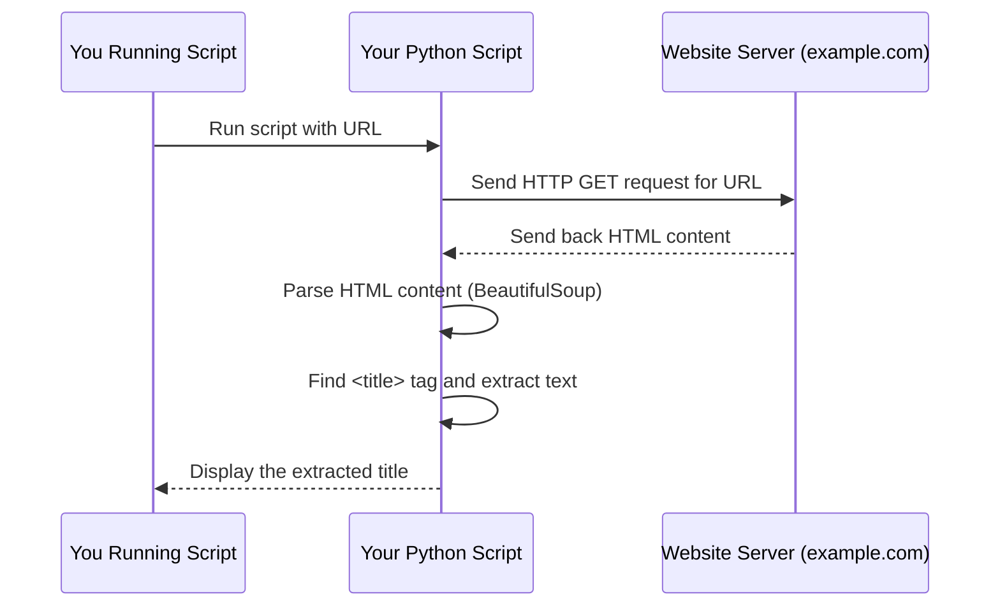

# Chapter 1: Web Scraping

Welcome to the first chapter of our tutorial! In this chapter, we'll explore the exciting world of "Web Scraping".

Imagine you need to collect information from the internet, like prices of products from an online store, news headlines from a news site, or details about cars from a car listing website. You could open each page one by one, read the information, and type it into a spreadsheet. But what if there are thousands or millions of pages? That would take forever!

This is where Web Scraping comes in.

## What is Web Scraping?

**Web Scraping** is an automated process for extracting data from websites. Think of it like sending a super-fast, tireless robot to a library to quickly scan many books and copy down specific details you need (like titles, authors, or dates) without you having to manually read every page. Instead of books, our robot is a program, and the library is the internet.

Its main purpose is to collect large amounts of data from websites quickly and efficiently.

## Why Do We Need Web Scraping?

The internet is a massive source of information. Many websites display data that isn't available for download in easy-to-use formats like CSV or Excel files. Web Scraping allows us to turn that human-readable information on a webpage into structured data that a computer can easily understand and analyze.

This structured data can then be used for various purposes, such as:

- Market research (tracking prices)
- News aggregation
- Building datasets for analysis or machine learning (like the car data mentioned in the [README.md](../README.md))
- Monitoring changes on websites

## How Does Web Scraping Work (Simply Put)?

At a high level, web scraping typically involves these steps:

1.  **You tell your script which website page to visit.**
2.  **Your script asks the website's server for that page.** The server sends back the page's content, usually in a format called HTML (HyperText Markup Language), which is the code that browsers use to display webpages.
3.  **Your script reads the HTML code.** This code contains the text, links, and structure of the page.
4.  **Your script finds the specific pieces of data you want** (like the title of an article, a product price, or a car's mileage) based on their location or tags in the HTML.
5.  **Your script extracts this data.**
6.  **Your script stores the data** in a format you can use, like a list, a CSV file, or a database.

Let's look at a very simple example: getting the title of a webpage.

## A Simple Web Scraping Example: Getting a Webpage Title

Imagine we want to get the main title of a simple webpage, like the title that appears in your browser's tab. This is often found within `<title>` tags in the HTML.

We can use Python for this, along with some helpful libraries. We'll need two main things:

1.  A way to _get_ the webpage content (like requesting it from the server). The `requests` library is great for this.
2.  A way to _read_ and _navigate_ the HTML content to find the specific pieces of data we want. The `BeautifulSoup` library is excellent for this.

_(Note: You would typically need to install these libraries first using commands like `pip install requests beautifulsoup4`.)_

Let's break down the process into tiny steps.

### Step 1: Request the Webpage

First, we need to get the HTML content of the page.

```python
import requests

# The URL of the page we want to scrape
url = "https://www.example.com"

# Send a request to the website
response = requests.get(url)

# Get the HTML content from the response
html_content = response.text

print("Successfully requested the page content!")
# print(html_content[:200]) # Optional: print first 200 chars to see it worked
```

**Explanation:**

- `import requests` tells Python we want to use the `requests` library.
- We define a variable `url` holding the address of the page.
- `requests.get(url)` sends a request to `https://www.example.com`.
- The result of the request is stored in the `response` variable.
- `response.text` gives us the raw HTML code of the page as a string.

Now, `html_content` contains the entire HTML of the page. But it's just a long string of text, which is hard to work with directly.

### Step 2: Parse the HTML

HTML has a structure, like nested boxes (tags). We need a tool to understand this structure so we can easily find specific "boxes" or tags, like the `<title>` tag. `BeautifulSoup` helps us do this.

```python
from bs4 import BeautifulSoup
# Assume html_content contains the HTML from Step 1

# Create a BeautifulSoup object to parse the HTML
soup = BeautifulSoup(html_content, 'html.parser')

print("Successfully parsed the HTML content!")
```

**Explanation:**

- `from bs4 import BeautifulSoup` imports the necessary tool.
- `BeautifulSoup(html_content, 'html.parser')` takes the raw HTML string and converts it into a structured object (`soup`) that we can easily search and navigate. `'html.parser'` tells BeautifulSoup how to understand the HTML code.

Now, `soup` is like an interactive map of the webpage's HTML structure.

### Step 3: Find the Data (The Page Title)

Now that we have our parsed HTML (`soup`), we can easily find specific elements using methods provided by `BeautifulSoup`. To get the page title, we look for the `<title>` tag.

```python
# Assume soup contains the parsed HTML from Step 2

# Find the <title> tag in the parsed HTML
title_tag = soup.find('title')

# Get the text inside the <title> tag
page_title = title_tag.get_text()

print("The page title is:")
print(page_title)
```

**Explanation:**

- `soup.find('title')` searches the entire parsed HTML structure for the _first_ occurrence of a `<title>` tag and returns it as a `title_tag` object.
- `title_tag.get_text()` extracts just the text that is _inside_ the `<title>` tag, ignoring the tags themselves.

And there you have it! You've successfully scraped the title of a webpage.

## Putting It All Together

Here's the complete, simple script to get the title of `https://www.example.com`:

```python
import requests
from bs4 import BeautifulSoup

url = "https://www.example.com"

# 1. Request the page
response = requests.get(url)
html_content = response.text

# 2. Parse the HTML
soup = BeautifulSoup(html_content, 'html.parser')

# 3. Find and extract the data (the title)
title_tag = soup.find('title')
page_title = title_tag.get_text()

print(f"The title of the page {url} is: {page_title}")
```

**Example Output:**

```
The title of the page https://www.example.com is: Example Domain
```

This tiny script demonstrates the core idea of web scraping: getting HTML and extracting specific data from it. Real-world scraping can be more complex, involving finding data within specific `div` or `class` tags, handling lists of items, dealing with pages that load content with JavaScript, and being respectful of the website's terms of service and robots.txt file. But the fundamental steps remain the same!

## How It Works Under the Hood (Simple View)

Let's visualize the simple title scraping process with a diagram:



**Explanation:**

1.  You start the Python script.
2.  Your script uses the `requests` library to ask the `example.com` server for the webpage data.
3.  The `example.com` server sends back the HTML code for that page.
4.  Your script receives the HTML and uses `BeautifulSoup` to make it easy to work with (parsing).
5.  BeautifulSoup helps your script locate the specific `<title>` tag and pull out just the text inside it.
6.  Finally, your script shows you the extracted title.

This is the fundamental interaction when you scrape a static webpage.

## Conclusion

In this chapter, we learned what Web Scraping is: the automated process of extracting data from websites. We saw why it's useful for collecting large datasets and walked through a basic example of how a script requests a webpage, parses its HTML, and extracts specific information (the page title).

This extracted information is what we call "Web-Scraped Data". In the next chapter, we will look more closely at what this data looks like after it has been scraped.

[Next Chapter: Web-Scraped Data](02_web_scraped_data_.md)

---
