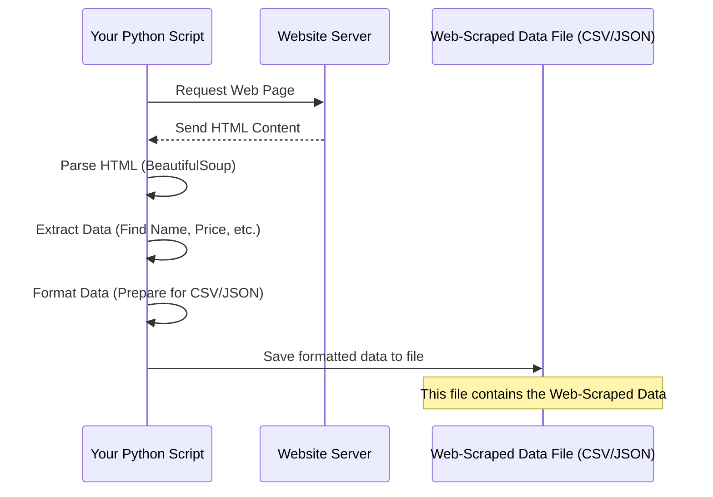

# Chapter 2: Web-Scraped Data

Welcome back! In the previous chapter, [Web Scraping](01_web_scraping_.md), we learned how to build little "robots" (scripts) that can automatically visit websites and extract information for us, like getting the title of a webpage. We saw how this automation is much faster than manually copying and pasting.

Now, imagine our helpful library robot from Chapter 1 has finished its task of scanning many books and copying down specific details you asked for. What do you get back? You get a pile of notes! This pile of notes is the raw output of the robot's work.

In the world of web scraping, this raw output is called **Web-Scraped Data**.

## What is Web-Scraped Data?

**Web-Scraped Data** is simply the information that your web scraping script has successfully extracted from websites. It's the raw, unprocessed data that comes directly from the web pages.

Think of it as the treasure chest you get _after_ digging using your scraping tool. This treasure chest contains everything you found, but it might still be mixed with dirt and needs sorting.

Its main characteristic is that it's the _direct result_ of the scraping process before any cleaning, transformation, or analysis happens.

## Why Is It Important to Understand Web-Scraped Data?

The data you scrape is your primary ingredient. Just like a chef needs to check the quality of raw ingredients before cooking, you need to look at your web-scraped data to understand:

1.  **What information did you actually get?** Did your script successfully capture everything you wanted?
2.  **What format is it in?** Is it easy to work with, or is it messy?
3.  **Are there any errors or missing pieces?** Websites aren't always perfectly structured, and scraping isn't always perfect.

Understanding the state of your web-scraped data is the absolutely crucial first step before you can do anything useful with it, like analyzing trends, building models, or displaying it nicely. It's the input for the next big step: [Data Preprocessing](03_data_preprocessing_.md).

## What Does Web-Scraped Data Look Like?

Web-scraped data can come in various forms, but two common structured formats are CSV (Comma Separated Values) and JSON (JavaScript Object Notation). Your scraping script usually saves the extracted data into a file in one of these formats.

Let's look at simple examples based on scraping a list of items (like hypothetical product listings, maybe similar to the cars mentioned in the [README.md](../README.md), but much simpler for illustration).

Imagine we scraped data for a few items, capturing just a "Name" and "Price".

### Example 1: CSV Format

CSV is like a simple spreadsheet. Each line is a record (like one product), and values on that line are separated by commas.

```csv
Name,Price
Item A,10.50
Item B,25.00
Item C,5.75
```

**Explanation:**

- The first line `Name,Price` is the header, telling you what each column represents.
- Each subsequent line is a record of one item.
- `Item A` has a price of `10.50`.
- `Item B` has a price of `25.00`.
- `Item C` has a price of `5.75`.

This is clean web-scraped data. Often, it might have extra spaces, missing values, or inconsistent formatting directly after scraping!

### Example 2: JSON Format

JSON is another popular format, often used for data exchange on the web. It's structured using key-value pairs, similar to Python dictionaries or lists.

```json
[
  {
    "Name": "Item A",
    "Price": "10.50"
  },
  {
    "Name": "Item B",
    "Price": "25.00"
  },
  {
    "Name": "Item C",
    "Price": "5.75"
  }
]
```

**Explanation:**

- The `[` and `]` indicate a list of items.
- Each item is enclosed in `{}` and is an object (like a record).
- Inside each object, data is stored as `"key": "value"` pairs. For example, `"Name": "Item A"` means the key "Name" has the value "Item A".
- Notice how the prices are strings ("10.50", "25.00", "5.75") instead of numbers. This is common in raw web-scraped data; you scrape the text as it appears on the page. Converting these to actual numbers would be part of [Data Preprocessing](03_data_preprocessing_.md)!

Both CSV and JSON are structured, but they are just the containers for the _raw_ data extracted.

## How Does the Scraping Process Lead to Web-Scraped Data?

Let's revisit the simple process from Chapter 1, but add the step where the data becomes "Web-Scraped Data".



**Explanation:**

1.  Your script asks the website for a page.
2.  The website sends back the raw HTML code.
3.  Your script uses tools (like `BeautifulSoup`) to read and understand the HTML structure.
4.  Your script finds the specific pieces of information you targeted (like product names and prices) within the HTML.
5.  Instead of just printing it, your script collects this extracted data.
6.  Crucially, your script then arranges this collected data into a structured format (like a list of dictionaries for JSON or rows/columns for CSV) and writes it into a file on your computer.

This file, containing the saved, raw extracted data, is your **Web-Scraped Data** file. The examples above show what the _inside_ of such a file might look like.

In the project you're exploring (`Data-Preprocessing-Web-Scraping`), the `/WebScraping/PakWheels` and `/WebScraping/ShopHive` folders contain code that performs steps 1-5 and then saves the results into CSV or JSON files. Those resulting files (like `pakwheels.csv` or `shophive_data.json` if they existed directly there) are examples of Web-Scraped Data before any significant cleaning happens.

## Using Web-Scraped Data

The Web-Scraped Data file is the input for the next stage: making it clean and ready for use. Because websites are inconsistent and scraping can sometimes pick up unwanted text or miss data, the raw scraped data is rarely perfect.

For instance, in the JSON example above, the prices are strings ("10.50"). For mathematical calculations or analysis, you'd need them as numbers (10.50). You might also have missing prices, inconsistent names ("Item A" vs "item A"), or extra details you didn't want.

All of these issues are addressed in the next phase.

## Conclusion

In this chapter, we've defined **Web-Scraped Data** as the raw output from the web scraping process. We saw that it's the direct information extracted from websites, often saved in structured formats like CSV or JSON files. We looked at simple examples of what this data can look like and understood its importance as the necessary input for making it usable.

Now that we have our raw Web-Scraped Data, the next crucial step is to clean and prepare it. This process is called [Data Preprocessing](03_data_preprocessing_.md), and we'll dive into it in the next chapter.

[Next Chapter: Data Preprocessing](03_data_preprocessing_.md)

---
