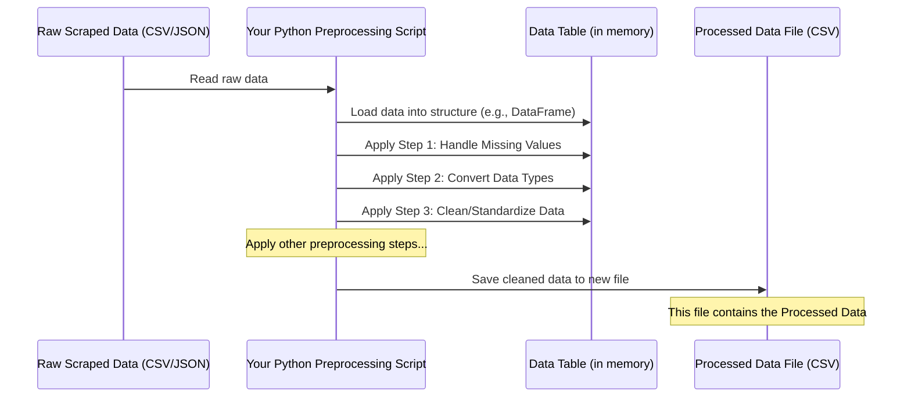

# Chapter 3: Data Preprocessing

Welcome back, data adventurers! In the previous chapter, [Web-Scraped Data](02_web_scraped_data_.md), we saw what the raw information looks like _after_ our scraping script pulls it from websites. We learned that this data, whether in a CSV or JSON file, is like a pile of raw ingredients – you've got the goods, but they aren't quite ready to be made into a delicious meal yet.

Think about those scraped car listings we mentioned in the project's [README.md](../README.md). You might have scraped the car's name, price, mileage, and engine size. Looking at the raw data, you might find:

- Some cars are missing the engine size.
- Prices are stored as text, like "$15,000" or "PKR 2,500,000".
- Mileage is text like "50,000 KM" or "30,000 miles".
- Sometimes a car might accidentally appear twice (a duplicate).

This is where **Data Preprocessing** comes in!

## What is Data Preprocessing?

**Data Preprocessing** is the essential step where we take our raw, web-scraped data and clean, transform, and organize it so it's ready for analysis, visualization, or feeding into machine learning models.

It's exactly like preparing those raw ingredients before cooking:

- **Cleaning:** Washing vegetables (removing dirt/errors).
- **Chopping:** Cutting ingredients into usable sizes/formats (converting text prices to numbers).
- **Mixing/Seasoning:** Combining ingredients or adding spices (handling missing data, standardizing units).

The goal is to turn messy, inconsistent raw data into clean, consistent, and usable data.

## Why Do We Need Data Preprocessing?

Why can't we just use the raw data?

1.  **Computers Need Numbers:** Analysis and machine learning algorithms work best with structured data, especially numbers. A price of "$15,000" or mileage of "50,000 KM" is just text to a computer. It can't do math with text!
2.  **Missing Information:** Models often struggle with missing data. Leaving gaps can lead to errors or inaccurate results.
3.  **Inconsistent Formats:** If some mileages are in "KM" and others in "miles", or some prices have currency symbols and others don't, comparing them directly is impossible.
4.  **Errors and Noise:** Scraping isn't always perfect. You might pick up extra symbols, whitespace, or even incorrect data points.

Preprocessing fixes these issues, ensuring the data is accurate, consistent, and in a format that software can understand and use effectively.

## Key Steps in Data Preprocessing

Data preprocessing involves several common steps. For our beginner introduction, let's focus on a few crucial ones often needed for scraped data:

1.  **Handling Missing Values:** Deciding what to do when some data points are missing.
2.  **Converting Data Types:** Changing data from one type (like text/string) to another (like a number/float).
3.  **Cleaning and Standardizing Data:** Making sure text is consistent (like removing extra spaces) and units are uniform.

Let's look at each of these with simple examples, imagining our car data. We'll use the idea of working with data structured like a table (similar to a spreadsheet), which is common in data analysis using libraries like Pandas in Python.

_(Note: The actual preprocessing code in this project, found for the Titanic dataset in the `/preprocessing` folder, uses the Pandas library to perform these kinds of steps on a table-like data structure called a DataFrame. We'll use simple examples here to illustrate the concepts.)_

### Step 1: Handling Missing Values

Imagine our car data in a simple table. Sometimes, a cell might just be empty because the website didn't list that information, or the scraper couldn't find it.

| Car Name | Price   | Mileage   | Engine Size |
| :------- | :------ | :-------- | :---------- |
| Sedan A  | $15,000 | 50,000 KM | 1600 cc     |
| SUV B    | $25,000 | 30,000 KM |             |
| Hatch C  | $10,000 |           | 1000 cc     |
| Sedan D  |         | 60,000 KM | 1800 cc     |

Notice the empty cells under "Engine Size" for SUV B, "Mileage" for Hatch C, and "Price" for Sedan D. These are _missing values_.

How do we handle them? Common simple strategies include:

- **Removing:** If a row (a car) has too many missing values, you might remove the entire row. If a column (like "Engine Size") has mostly missing values, you might remove the entire column. This is simple but can lose useful data.
- **Filling (Imputation):** Fill the missing gaps with a chosen value. You could fill with:
  - A specific placeholder (like 0, though be careful if 0 is a valid value).
  - The average (mean) value of that column (e.g., fill missing mileage with the average mileage of all other cars).
  - The middle value (median) of that column.

Choosing the right method depends on the data and what you plan to do with it. For beginners, removing rows with missing critical data or filling with a simple value like the mean are common starting points.

Let's imagine using a simple data structure (like a Pandas DataFrame) to represent our table and see a _conceptual_ code example for removing rows with _any_ missing values:

```python
# Imagine 'car_data' is our data table (DataFrame)
# with missing values represented like this: NaN

# Before handling missing values
# print(car_data)

# Simple way: Remove rows that have *any* missing values
cleaned_data_no_missing_rows = car_data.dropna()

# print("\nData after removing rows with missing values:")
# print(cleaned_data_no_missing_rows)
```

**Explanation:**

- We start with our `car_data` which contains missing values.
- `.dropna()` is a command that tells the data structure to remove any row where _at least one_ value is missing.
- The result is a new table `cleaned_data_no_missing_rows` without any missing values in any cell.
- This is a very basic example; real-world code might specify _which_ columns to check for missing values or use more advanced filling methods.

### Step 2: Converting Data Types

Look at the "Price" column: "$15,000", "$25,000", etc. These are text strings. We can't calculate the average price or compare prices numerically when they are text. We need to convert them to numbers (like integers or floats).

We also need to clean them first by removing non-numeric characters like '$' or commas.

Imagine a simple column of prices as text:

| Price   |
| :------ |
| $15,000 |
| $25,000 |
| $10,000 |

We want to turn this into:

| Price   |
| :------ |
| 15000.0 |
| 25000.0 |
| 10000.0 |

Conceptual code steps:

```python
# Imagine 'car_data' now only has the 'Price' column as text

# Step 1: Remove '$' and ','
# This uses string operations to replace characters
car_data['Price_cleaned_text'] = car_data['Price'].str.replace('$', '', regex=False).str.replace(',', '', regex=False)

# print("After removing symbols:")
# print(car_data[['Price', 'Price_cleaned_text']])

# Step 2: Convert the cleaned text to a number (float)
car_data['Price_numeric'] = car_data['Price_cleaned_text'].astype(float)

# print("\nAfter converting to numeric type:")
# print(car_data[['Price', 'Price_cleaned_text', 'Price_numeric']])
# Check the data type (should be float now)
# print(car_data['Price_numeric'].dtype)
```

**Explanation:**

- We create a new column `Price_cleaned_text` by taking the original 'Price' column and removing the '$' and ',' characters using string replacement functions (`.str.replace()`).
- Then, we take that cleaned text column and use `.astype(float)` to convert it into a column of floating-point numbers (numbers with decimal points).
- Now the 'Price_numeric' column contains actual numbers that can be used for calculations.

Similar steps would be needed for "Mileage" and "Engine Size" if they contain units or non-numeric characters.

### Step 3: Cleaning and Standardizing Data

Sometimes, data points are inconsistent even if they are the right type. For example, mileage might be "50,000 KM" in one row and "30000 miles" in another. Or text might have extra spaces ("Sedan A " instead of "Sedan A").

Standardizing means making units consistent (e.g., converting all mileage to KM or all to miles) and cleaning up text.

Example: Cleaning "Mileage" text:

| Mileage     |
| :---------- |
| 50,000 KM   |
| 30000 miles |
| 60,000 KM   |
| 45000 kms   |

We want to clean this to just the number, and potentially convert "miles" to "KM" if needed (a more advanced step). Let's focus on just removing units and commas for simplicity first.

```python
# Imagine 'car_data' has the 'Mileage' column as text

# Step 1: Remove units (' KM', ' miles', ' kms') and commas
cleaned_mileage_text = car_data['Mileage'].str.replace(' KM', '', regex=False)
cleaned_mileage_text = cleaned_mileage_text.str.replace(' miles', '', regex=False)
cleaned_mileage_text = cleaned_mileage_text.str.replace(' kms', '', regex=False)
cleaned_mileage_text = cleaned_mileage_text.str.replace(',', '', regex=False)

car_data['Mileage_cleaned_text'] = cleaned_mileage_text

# print("After removing units and commas:")
# print(car_data[['Mileage', 'Mileage_cleaned_text']])

# Step 2: Convert to a number (integer or float)
car_data['Mileage_numeric'] = car_data['Mileage_cleaned_text'].astype(float) # or .astype(int) if no decimals

# print("\nAfter converting to numeric type:")
# print(car_data[['Mileage', 'Mileage_cleaned_text', 'Mileage_numeric']])
```

**Explanation:**

- We apply multiple `.str.replace()` operations one after another to remove different unit strings and commas from the 'Mileage' column.
- The result is stored in `Mileage_cleaned_text`.
- Finally, we convert this cleaned text into a number type (`float`).

These are just a few simple preprocessing steps, but they are fundamental to making data usable. Other steps might include handling duplicate rows, encoding categorical data (like converting "Sedan" and "SUV" text into numbers if a model requires it), scaling numbers, etc.

## How Data Preprocessing Works (Simple View)

Let's visualize the preprocessing flow:



**Explanation:**

1.  Your Python script starts, designed to preprocess data.
2.  It reads the raw data file (the [Web-Scraped Data](02_web_scraped_data_.md) you created).
3.  The script loads this data into a structure in the computer's memory that's easy to work with, like a Pandas DataFrame (represented here as `CleanedDataFrame`).
4.  The script then applies the preprocessing steps you define, one by one, modifying the data within the DataFrame.
5.  After all steps are complete, the script saves the modified, clean data into a new file (represented as `ProcessedDataFile`).

The `/preprocessing` folder in this project contains a Jupyter notebook (`data_preprocessing.ipynb`) that demonstrates many of these preprocessing steps applied to the Titanic dataset. While the dataset is different, the _techniques_ for handling missing values, converting types, and cleaning data shown there are the same ones you would apply to web-scraped data like the car listings from PakWheels or items from ShopHive.

## Conclusion

In this chapter, we learned that **Data Preprocessing** is the crucial step of cleaning and transforming raw data to make it usable. We saw why it's necessary due to issues like missing values, wrong data types, and inconsistent formatting often found in [Web-Scraped Data](02_web_scraped_data_.md). We explored three basic preprocessing steps: handling missing values, converting data types, and cleaning/standardizing data, with simple examples illustrating how these transformations make the data ready.

The result of all this hard work is data that is clean, consistent, and properly formatted – this is what we call **Processed Data**. In the next chapter, we'll look at what this processed data looks like and why it's so much more useful than the raw data we started with.

[Next Chapter: Processed Data](04_processed_data_.md)
