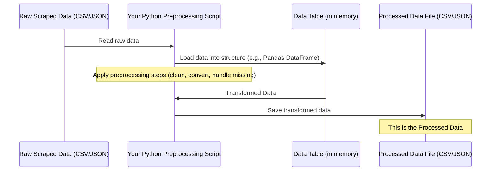

# Chapter 4: Processed Data

Welcome back! In our journey, we've gone from understanding how to automatically extract data from websites ([Web Scraping](01_web_scraping_.md)), to looking at that raw information as it comes out ([Web-Scraped Data](02_web_scraped_data_.md)), and then learning how to clean and prepare it using [Data Preprocessing](03_data_preprocessing_.md).

Now, after all that hard work of cleaning, converting, and organizing, what do we have? We have **Processed Data**.

## What is Processed Data?

**Processed Data** is the clean, organized, and transformed version of your original raw data. It's the final output of the data preprocessing stage, ready to be used immediately for whatever you planned to do next – whether that's analyzing trends, creating visualizations, or training a machine learning model.

Think back to our cooking analogy:

- [Web Scraping](01_web_scraping_.md) was gathering all your ingredients (raw vegetables, uncooked meat, spices).
- [Web-Scraped Data](02_web_scraped_data_.md) was the pile of ingredients on your counter – some might be dirty, unpeeled, or in awkward sizes.
- [Data Preprocessing](03_data_preprocessing_.md) was the preparation: washing, chopping, peeling, measuring, and maybe marinating.
- **Processed Data** is the result: all your ingredients are now neatly chopped, measured, and ready to be put into the pan or pot to cook the final dish!

Its main characteristic is that it's structured, consistent, and free (or mostly free) from the errors and inconsistencies found in the raw, scraped data.

## Why Is Processed Data So Important?

You need processed data because raw data is usually unusable by itself for serious tasks.

- **Analysis:** You can't calculate the average car price if prices are text like "$15,000" or "PKR 2,500,000". Processed data has these as actual numbers.
- **Visualization:** Trying to create charts from messy, inconsistent data is impossible. Clean, processed data ensures your charts are accurate and meaningful.
- **Machine Learning:** Almost all machine learning algorithms require numerical, structured data without missing values or inconsistent formats. Feeding raw data into a model will likely result in errors or very poor performance.

Processed data is the bridge that connects the raw information you collected to the insights or models you want to build. It's the required input for the next stages of any data project.

## What Does Processed Data Look Like?

Processed data usually maintains a similar structure to the raw data (like a table), but the _values_ inside are cleaned and standardized.

Let's revisit the simple car data example we used in [Data Preprocessing](03_data_preprocessing_.md), but now see what it looks like _after_ those cleaning steps.

Remember this raw data table with missing values and messy text?

| Car Name | Price   | Mileage   | Engine Size |
| :------- | :------ | :-------- | :---------- |
| Sedan A  | $15,000 | 50,000 KM | 1600 cc     |
| SUV B    | $25,000 | 30,000 KM |             |
| Hatch C  | $10,000 |           | 1000 cc     |
| Sedan D  |         | 60,000 KM | 1800 cc     |

After applying preprocessing steps like handling missing values (e.g., removing rows with critical missing data) and converting types (removing '$', ',', ' KM', ' cc', ' miles', and converting to numbers), the processed data might look like this (assuming we removed the row for Sedan D because the price was missing):

| Car Name | Price   | Mileage | Engine Size |
| :------- | :------ | :------ | :---------- |
| Sedan A  | 15000.0 | 50000.0 | 1600.0      |
| SUV B    | 25000.0 | 30000.0 | NaN         |
| Hatch C  | 10000.0 | NaN     | 1000.0      |

**Explanation:**

- The '$' and ',' are gone from Price, and it's now a number (float).
- The units (' KM', ' cc') and ',' are gone from Mileage and Engine Size, and they are numbers (float).
- The missing values might still be represented specially (like `NaN` - Not a Number), or they might have been filled in, depending on the preprocessing strategy used.
- The data types for Price, Mileage, and Engine Size columns are now numerical (like `float` or `int`), not text (`string`).

If saved to a CSV file, it would look much cleaner:

```csv
Car Name,Price,Mileage,Engine Size
Sedan A,15000.0,50000.0,1600.0
SUV B,25000.0,30000.0,NaN
Hatch C,10000.0,NaN,1000.0
```

If saved to a JSON file, it might look like this:

```json
[
  {
    "Car Name": "Sedan A",
    "Price": 15000.0,
    "Mileage": 50000.0,
    "Engine Size": 1600.0
  },
  {
    "Car Name": "SUV B",
    "Price": 25000.0,
    "Mileage": 30000.0,
    "Engine Size": null
  },
  {
    "Car Name": "Hatch C",
    "Price": 10000.0,
    "Mileage": null,
    "Engine Size": 1000.0
  }
]
```

Notice the key difference from the raw JSON in Chapter 2: numerical values are represented as actual numbers (without quotes) and missing values as `null`. This is data that software can easily work with!

## How Do We Get Processed Data (Workflow)?

The processed data file is the direct result of running your preprocessing script on the raw data.

Here's the workflow we saw conceptually in the last chapter, but highlighting the final output:



**Explanation:**

1.  You start your preprocessing script.
2.  The script reads the raw data file ([Web-Scraped Data](02_web_scraped_data_.md)).
3.  It loads the data into a suitable data structure in memory (like a Pandas DataFrame in Python), which makes applying transformations easy.
4.  The script applies all the [Data Preprocessing](03_data_preprocessing_.md) steps you defined (cleaning text, converting types, handling missing data, etc.).
5.  Once all transformations are done, the script saves the resulting clean data from the in-memory structure into a new file on your computer.

This new file contains your **Processed Data**, ready for the next steps in your project. In this repository, the Jupyter notebook in the `/preprocessing` folder demonstrates these steps on the Titanic dataset, saving a processed version of that data. The same principles apply to processing the car data scraped from PakWheels or items from ShopHive.

## Using Processed Data

With your data processed, you can finally dive into the exciting parts!

- You can perform statistical analysis: Calculate average price, find the range of mileage, see the distribution of engine sizes.
- You can create compelling visualizations: Plot price vs. mileage, visualize the count of cars by model year.
- You can train a machine learning model: Build a model to predict a car's price based on its features, or classify cars by type.

Processed data makes all these tasks straightforward because the data is in the correct format and free of common errors.

## Conclusion

In this chapter, we've understood that **Processed Data** is the valuable output of the [Data Preprocessing](03_data_preprocessing_.md) stage. It's the clean, transformed, and ready-to-use version of the raw data we originally scraped. We saw how it contrasts with raw data and why its structure and cleanliness are essential for analysis, visualization, and machine learning.

Now that we understand the data flow from scraping to processing, we can look back at the bigger picture and understand the logic behind designing the scraping process itself.

[Next Chapter: Scraping Logic](05_scraping_logic_.md)

---
