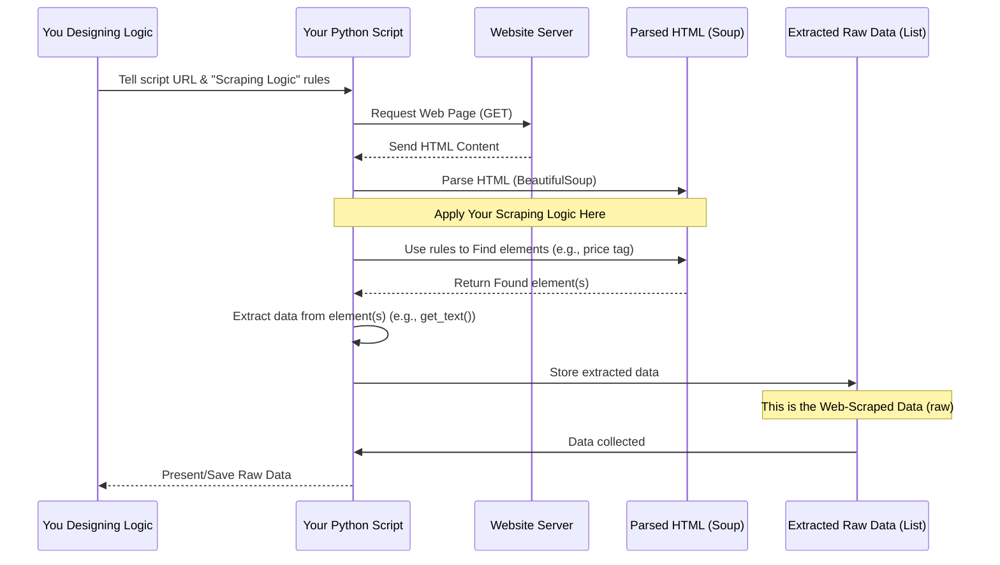

# Chapter 5: Scraping Logic

Welcome back for the final chapter in this introductory series! We've journeyed from understanding how to automatically grab data from websites ([Web Scraping](01_web_scrapping_.md)), to seeing what that raw data looks like ([Web-Scraped Data](02_web_scraped_data_.md)), and then learning how to clean and structure it ([Data Preprocessing](03_data_preprocessing_.md)) to get sparkling clean data ready for use ([Processed Data](04_processed_data_.md)).

Now, let's take a step back and look at _how_ we tell our scraping script exactly _what_ information we want from a website and _where_ to find it. This is where the concept of **Scraping Logic** comes in.

Imagine our friendly library robot again. We know it can scan books, but we need to give it precise instructions: "Go to the 'Science' section, shelf 3. On each book, find the 'Publication Date' on the copyright page. Write down only the year." This set of detailed instructions is the robot's "Scraping Logic" for that specific task and location.

## What is Scraping Logic?

**Scraping Logic** is the specific set of instructions, usually written in code, that tells your web scraping tool exactly what information to find on a particular webpage and how to extract it.

It's the core "intelligence" you build into your scraper for a specific website. Websites are all different – the price of a product might be labeled differently or placed in a different part of the page's code on Amazon compared to eBay or ShopHive. Your scraping logic must be tailored to the structure of the website you are targeting.

Think of it as writing a detailed map and a set of rules for your script:

1.  **The Map:** How to navigate the structure of the webpage (which is built with HTML).
2.  **The Rules:** What specific pieces of information to look for (e.g., text inside a price tag, text inside a car's mileage tag).

## Why Do We Need Scraping Logic?

The internet is not a giant database neatly organized for computers. Websites are designed for _humans_ to read and interact with. Web scraping works by reading the underlying code of the page (HTML), which describes how the page is structured and what content it contains.

Scraping Logic is necessary because:

- **Websites are inconsistent:** The way data is presented in the HTML varies greatly from site to site.
- **We need specific data:** We usually don't want _everything_ on a page, only specific items like product names, prices, or car mileage.
- **HTML structure:** Data is embedded within HTML tags, and we need a way to pinpoint the correct tags that contain the information we want.

Without tailored Scraping Logic, your script wouldn't know the difference between a product price and a comment, or a car's mileage and its engine size.

## How Do We Build Scraping Logic?

Building scraping logic primarily involves two steps after you've retrieved the page's HTML:

1.  **Inspect the Website's HTML:** Look at the webpage's source code to understand its structure and identify where the data you want is located.
2.  **Write Code to Navigate and Extract:** Use a library like `BeautifulSoup` (as introduced in [Chapter 1: Web Scraping](01_web_scrapping_.md)) to programmatically find and pull out the data based on your inspection.

Let's focus on the second step, using Python and `BeautifulSoup`.

### Step 1: Understanding HTML Structure (A Tiny Bit More)

Remember from Chapter 1 that websites are made of HTML tags. These tags are often nested inside each other. Attributes like `class` or `id` are commonly used by website designers to label parts of the page, and these are _very_ useful for scraping logic!

Example: A simplified HTML snippet for a product price:

```html
<div>
  <p class="product-name">Fancy Gadget</p>
  <div class="price-box">
    <span class="currency">$</span>
    <span class="value">199.99</span>
  </div>
</div>
```

In this example:

- `<div>` tags are like containers.
- `<p>` and `<span>` tags hold text.
- `class="product-name"`, `class="price-box"`, etc., are attributes used to label these containers or pieces of text.

Our Scraping Logic needs to say: "Find the `div` with the class `price-box`, and then find the `span` inside it with the class `value`, and get the text from that `span`."

### Step 2: Writing Code to Navigate and Extract

Using `BeautifulSoup`, we can translate our "map and rules" into Python code. Let's assume we have the `soup` object (the parsed HTML) from Chapter 1.

We use methods like `find()` and `find_all()` to search the `soup` object.

- `soup.find('tag_name')`: Finds the first occurrence of a tag (e.g., `soup.find('div')`).
- `soup.find('tag_name', attributes)`: Finds the first tag matching the name AND attributes (e.g., `soup.find('div', {'class': 'price-box'})`).
- `soup.find_all('tag_name', attributes)`: Finds _all_ occurrences (e.g., `soup.find_all('p', {'class': 'product-name'})` would find all product name paragraphs if there were many).

Once we find an element, we can get its text using `.get_text()` or attributes using square brackets like a dictionary (`['attribute_name']`).

Let's use the HTML snippet above and write logic to get the price value "199.99":

```python
# Assume 'soup' contains the parsed HTML from the example snippet

# Find the <div> tag that has the class "price-box"
price_box_element = soup.find('div', {'class': 'price-box'})

# Check if we found the price box (good practice!)
if price_box_element:
    # Inside the price box, find the <span> tag with the class "value"
    price_value_element = price_box_element.find('span', {'class': 'value'})

    # Check if we found the value element
    if price_value_element:
        # Get the text inside that <span> tag
        price = price_value_element.get_text()
        print(f"Found the price: {price}")
    else:
        print("Could not find the price value element.")
else:
    print("Could not find the price box element.")

# Example Output (if HTML was parsed):
# Found the price: 199.99
```

**Explanation:**

- We first look for the main container holding the price, specifically the `div` with `class="price-box"`.
- If found, we then search _within that specific `div`_ for the `span` tag that has `class="value"`. This makes our search more precise.
- If that element is also found, we use `.get_text()` to extract the actual price number as a string.
- The `if` checks are important because if an element isn't found (maybe the website structure changed), the script won't crash trying to get text from something that doesn't exist.

This sequence of finding specific tags and attributes, then extracting the text, is the core of **Scraping Logic**. For each piece of information you need (name, price, mileage, etc.), you write a specific set of instructions based on where it lives in the HTML.

## How Scraping Logic Fits in the Workflow (Simple View)

Let's visualize the overall scraping process, now highlighting where our specific finding rules come into play:



**Explanation:**

1.  _You_ inspect the website and design the specific "Scraping Logic" (the find/extract rules).
2.  You incorporate this logic into your Python script.
3.  Your script requests the HTML from the website.
4.  The website sends back the HTML.
5.  Your script parses the HTML into a navigable `soup` object.
6.  Crucially, your script then applies the "Scraping Logic" you designed. It uses methods like `find()` to locate the specific parts of the HTML that contain the data you want.
7.  It extracts the actual data (like the price text) from the located elements.
8.  It collects this extracted data into a structure (like a list of dictionaries or rows). This is the [Web-Scraped Data](02_web_scraped_data_.md).
9.  This raw data is then saved or passed on for [Data Preprocessing](03_data_preprocessing_.md).

The code files in the `/WebScraping/PakWheels` and `/WebScraping/ShopHive` folders in this project contain the specific, detailed scraping logic written for those particular websites. They implement these `find()` and extraction steps to pull out information like car titles, prices, mileage, etc., or product names and prices, based on how those websites' HTML is structured.

Designing good Scraping Logic requires careful inspection of the target website's HTML using your browser's developer tools (often accessed by right-clicking on an element on the page and selecting "Inspect" or "Inspect Element"). This allows you to see the tags, classes, and IDs that uniquely identify the data you need.

## Conclusion

In this chapter, we've learned that **Scraping Logic** is the tailored set of instructions our script uses to pinpoint and extract specific data from a website's HTML structure. It's the bridge between getting a page's raw code and getting the structured information we actually want. We saw how inspecting HTML and using libraries like `BeautifulSoup` to `find()` and extract data based on tags and attributes forms the basis of this logic.

Understanding Scraping Logic is fundamental to successful web scraping, as it dictates what data you will collect (your [Web-Scraped Data](02_web_scraped_data_.md)) which then serves as the input for [Data Preprocessing](03_data_preprocessing_.md) to get your final [Processed Data](04_processed_data_.md).

This concludes our introductory tutorial on these core concepts within the `Data-Preprocessing-Web-Scraping` project. You now have a foundational understanding of the journey data takes from being scattered on the web to being clean and ready for analysis!

---
