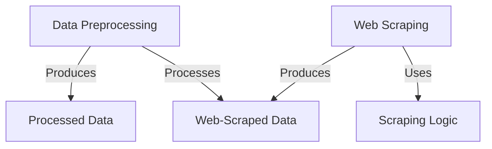
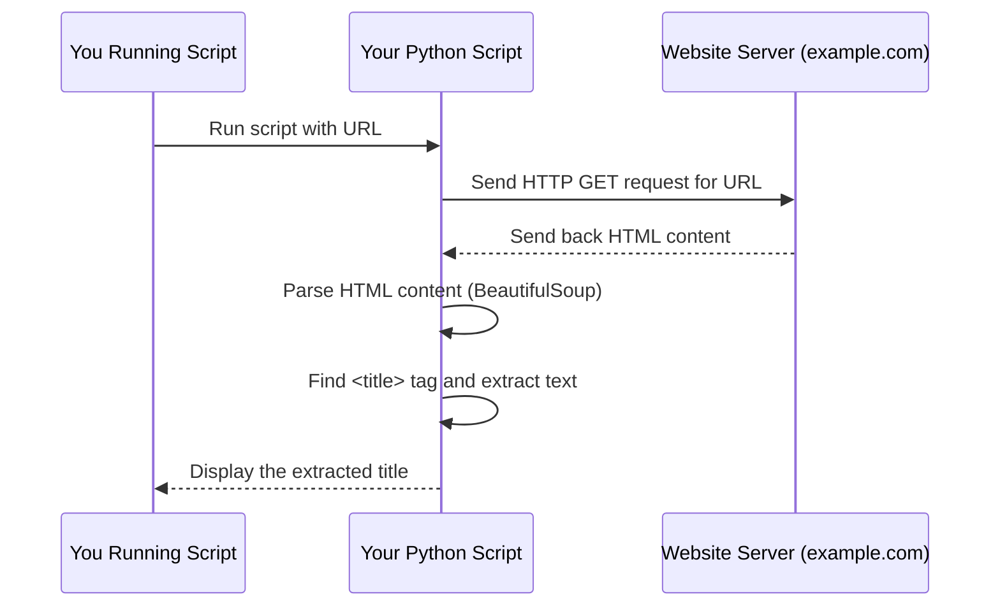
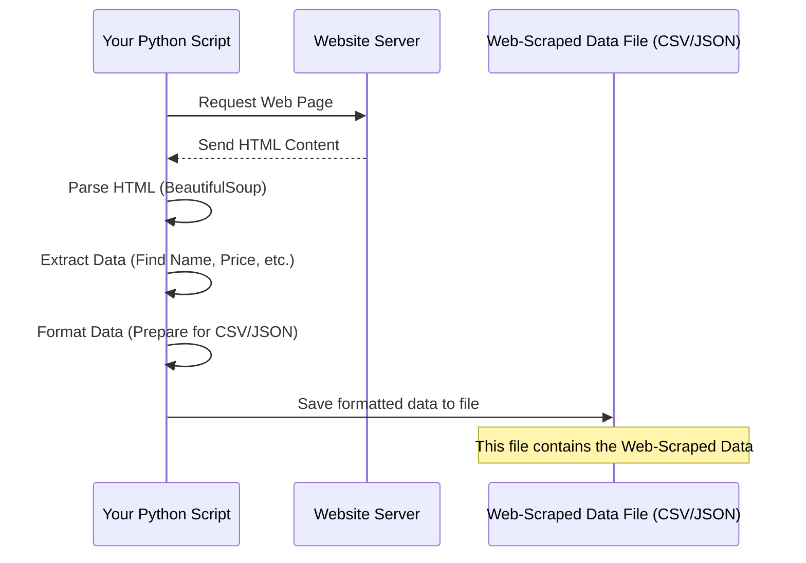
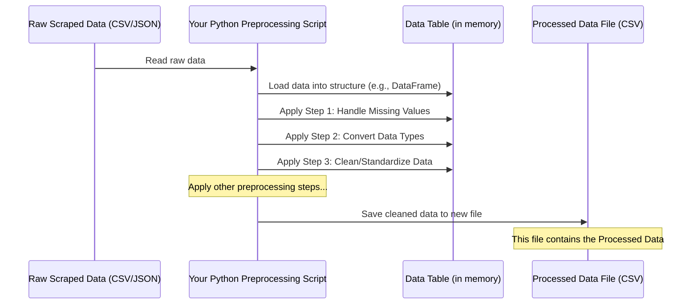
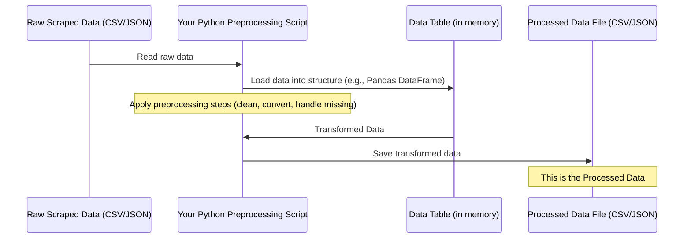
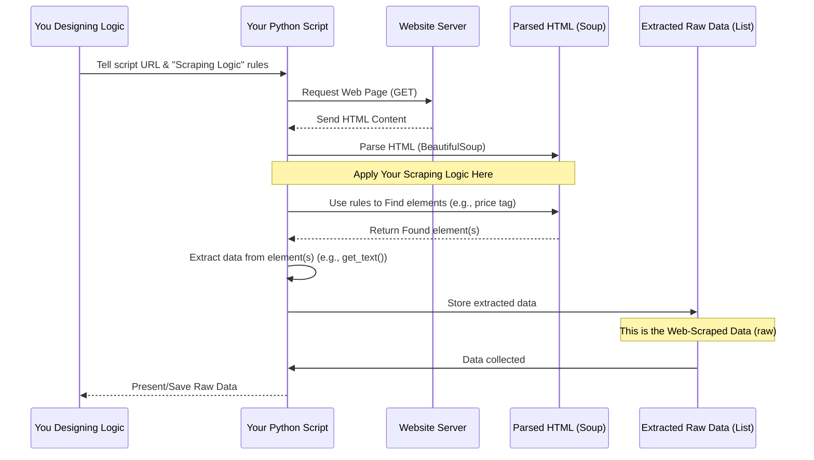

Here is the updated `README.md` with your requested changes:

---

#  Data Preprocessing &  Web Scraping 

This repository contains preprocessing scripts and web scraping code for two projects:

1. **Titanic Dataset**
2. **Web Scraping Datasets** (`PakWheels` and `ShopHive`)

---

## 📊 Titanic Dataset

The Titanic dataset contains information about passengers, including their demographics, ticket details, and survival status.
It is commonly used for classification tasks such as predicting survival based on features like age, gender, class, etc.

**🔗 Dataset Link:**
[https://www.kaggle.com/datasets/zainmahmod/pakistan-used-cars-2025](https://www.kaggle.com/datasets/zainmahmod/pakistan-used-cars-2025)

**📁 Folder:**
`/preprocessing` — contains a Jupyter notebook with all preprocessing steps including handling missing values, feature encoding, and scaling.

---

## 🕸️ Web Scraping

This section includes two folders for different web-scraped datasets:

### 🛻 PakWheels Used Cars Dataset

This dataset was created by scraping publicly available data from [PakWheels.com](https://www.pakwheels.com), covering used car listings across Pakistan.
It includes features such as title, mileage, model, engine capacity, price, transmission, and more.

**🔗 Dataset Link:**
👉 [View on Kaggle](https://www.kaggle.com/datasets/zainmahmod/pakistan-used-cars-2025)

**📁 Folder:**
`/WebScraping/PakWheels` — contains the Python code used to scrape PakWheels listings and export them to a CSV file.

---

### 🛒 ShopHive Dataset

Data was scraped from [ShopHive.com](https://www.shophive.com) to collect product listings for tech and consumer items.

**📁 Folder:**
`/WebScraping/ShopHive` — contains Python scripts and a JSON file with the scraped data.

---
# Tutorial: Data-Preprocessing-Web-Scraping

This project is about collecting and preparing data.
It includes **Web Scraping** tools to *automatically gather* raw information from websites like car listings and product details.
It also provides **Data Preprocessing** steps to *clean and transform* this raw data, making it ready for analysis or use in other applications.


## Visual Overview



## Chapters

1. [Web Scraping
](01_web_scraping_.md)
2. [Web-Scraped Data
](02_web_scraped_data_.md)
3. [Data Preprocessing
](03_data_preprocessing_.md)
4. [Processed Data
](04_processed_data_.md)
5. [Scraping Logic
](05_scraping_logic_.md)

---
# Chapter 1: Web Scraping

Welcome to the first chapter of our tutorial! In this chapter, we'll explore the exciting world of "Web Scraping".

Imagine you need to collect information from the internet, like prices of products from an online store, news headlines from a news site, or details about cars from a car listing website. You could open each page one by one, read the information, and type it into a spreadsheet. But what if there are thousands or millions of pages? That would take forever!

This is where Web Scraping comes in.

## What is Web Scraping?

**Web Scraping** is an automated process for extracting data from websites. Think of it like sending a super-fast, tireless robot to a library to quickly scan many books and copy down specific details you need (like titles, authors, or dates) without you having to manually read every page. Instead of books, our robot is a program, and the library is the internet.

Its main purpose is to collect large amounts of data from websites quickly and efficiently.

## Why Do We Need Web Scraping?

The internet is a massive source of information. Many websites display data that isn't available for download in easy-to-use formats like CSV or Excel files. Web Scraping allows us to turn that human-readable information on a webpage into structured data that a computer can easily understand and analyze.

This structured data can then be used for various purposes, such as:
*   Market research (tracking prices)
*   News aggregation
*   Building datasets for analysis or machine learning (like the car data mentioned in the [README.md](../README.md))
*   Monitoring changes on websites

## How Does Web Scraping Work (Simply Put)?

At a high level, web scraping typically involves these steps:

1.  **You tell your script which website page to visit.**
2.  **Your script asks the website's server for that page.** The server sends back the page's content, usually in a format called HTML (HyperText Markup Language), which is the code that browsers use to display webpages.
3.  **Your script reads the HTML code.** This code contains the text, links, and structure of the page.
4.  **Your script finds the specific pieces of data you want** (like the title of an article, a product price, or a car's mileage) based on their location or tags in the HTML.
5.  **Your script extracts this data.**
6.  **Your script stores the data** in a format you can use, like a list, a CSV file, or a database.

Let's look at a very simple example: getting the title of a webpage.

## A Simple Web Scraping Example: Getting a Webpage Title

Imagine we want to get the main title of a simple webpage, like the title that appears in your browser's tab. This is often found within `<title>` tags in the HTML.

We can use Python for this, along with some helpful libraries. We'll need two main things:

1.  A way to *get* the webpage content (like requesting it from the server). The `requests` library is great for this.
2.  A way to *read* and *navigate* the HTML content to find the specific pieces of data we want. The `BeautifulSoup` library is excellent for this.

*(Note: You would typically need to install these libraries first using commands like `pip install requests beautifulsoup4`.)*

Let's break down the process into tiny steps.

### Step 1: Request the Webpage

First, we need to get the HTML content of the page.

```python
import requests

# The URL of the page we want to scrape
url = "https://www.example.com"

# Send a request to the website
response = requests.get(url)

# Get the HTML content from the response
html_content = response.text

print("Successfully requested the page content!")
# print(html_content[:200]) # Optional: print first 200 chars to see it worked
```

**Explanation:**
*   `import requests` tells Python we want to use the `requests` library.
*   We define a variable `url` holding the address of the page.
*   `requests.get(url)` sends a request to `https://www.example.com`.
*   The result of the request is stored in the `response` variable.
*   `response.text` gives us the raw HTML code of the page as a string.

Now, `html_content` contains the entire HTML of the page. But it's just a long string of text, which is hard to work with directly.

### Step 2: Parse the HTML

HTML has a structure, like nested boxes (tags). We need a tool to understand this structure so we can easily find specific "boxes" or tags, like the `<title>` tag. `BeautifulSoup` helps us do this.

```python
from bs4 import BeautifulSoup
# Assume html_content contains the HTML from Step 1

# Create a BeautifulSoup object to parse the HTML
soup = BeautifulSoup(html_content, 'html.parser')

print("Successfully parsed the HTML content!")
```

**Explanation:**
*   `from bs4 import BeautifulSoup` imports the necessary tool.
*   `BeautifulSoup(html_content, 'html.parser')` takes the raw HTML string and converts it into a structured object (`soup`) that we can easily search and navigate. `'html.parser'` tells BeautifulSoup how to understand the HTML code.

Now, `soup` is like an interactive map of the webpage's HTML structure.

### Step 3: Find the Data (The Page Title)

Now that we have our parsed HTML (`soup`), we can easily find specific elements using methods provided by `BeautifulSoup`. To get the page title, we look for the `<title>` tag.

```python
# Assume soup contains the parsed HTML from Step 2

# Find the <title> tag in the parsed HTML
title_tag = soup.find('title')

# Get the text inside the <title> tag
page_title = title_tag.get_text()

print("The page title is:")
print(page_title)
```

**Explanation:**
*   `soup.find('title')` searches the entire parsed HTML structure for the *first* occurrence of a `<title>` tag and returns it as a `title_tag` object.
*   `title_tag.get_text()` extracts just the text that is *inside* the `<title>` tag, ignoring the tags themselves.

And there you have it! You've successfully scraped the title of a webpage.

## Putting It All Together

Here's the complete, simple script to get the title of `https://www.example.com`:

```python
import requests
from bs4 import BeautifulSoup

url = "https://www.example.com"

# 1. Request the page
response = requests.get(url)
html_content = response.text

# 2. Parse the HTML
soup = BeautifulSoup(html_content, 'html.parser')

# 3. Find and extract the data (the title)
title_tag = soup.find('title')
page_title = title_tag.get_text()

print(f"The title of the page {url} is: {page_title}")
```

**Example Output:**

```
The title of the page https://www.example.com is: Example Domain
```

This tiny script demonstrates the core idea of web scraping: getting HTML and extracting specific data from it. Real-world scraping can be more complex, involving finding data within specific `div` or `class` tags, handling lists of items, dealing with pages that load content with JavaScript, and being respectful of the website's terms of service and robots.txt file. But the fundamental steps remain the same!

## How It Works Under the Hood (Simple View)

Let's visualize the simple title scraping process with a diagram:



**Explanation:**

1.  You start the Python script.
2.  Your script uses the `requests` library to ask the `example.com` server for the webpage data.
3.  The `example.com` server sends back the HTML code for that page.
4.  Your script receives the HTML and uses `BeautifulSoup` to make it easy to work with (parsing).
5.  BeautifulSoup helps your script locate the specific `<title>` tag and pull out just the text inside it.
6.  Finally, your script shows you the extracted title.

This is the fundamental interaction when you scrape a static webpage.

## Conclusion

In this chapter, we learned what Web Scraping is: the automated process of extracting data from websites. We saw why it's useful for collecting large datasets and walked through a basic example of how a script requests a webpage, parses its HTML, and extracts specific information (the page title).

This extracted information is what we call "Web-Scraped Data". In the next chapter, we will look more closely at what this data looks like after it has been scraped.

[Next Chapter: Web-Scraped Data](02_web_scraped_data_.md)

---

# Chapter 2: Web-Scraped Data

Welcome back! In the previous chapter, [Web Scraping](01_web_scraping_.md), we learned how to build little "robots" (scripts) that can automatically visit websites and extract information for us, like getting the title of a webpage. We saw how this automation is much faster than manually copying and pasting.

Now, imagine our helpful library robot from Chapter 1 has finished its task of scanning many books and copying down specific details you asked for. What do you get back? You get a pile of notes! This pile of notes is the raw output of the robot's work.

In the world of web scraping, this raw output is called **Web-Scraped Data**.

## What is Web-Scraped Data?

**Web-Scraped Data** is simply the information that your web scraping script has successfully extracted from websites. It's the raw, unprocessed data that comes directly from the web pages.

Think of it as the treasure chest you get *after* digging using your scraping tool. This treasure chest contains everything you found, but it might still be mixed with dirt and needs sorting.

Its main characteristic is that it's the *direct result* of the scraping process before any cleaning, transformation, or analysis happens.

## Why Is It Important to Understand Web-Scraped Data?

The data you scrape is your primary ingredient. Just like a chef needs to check the quality of raw ingredients before cooking, you need to look at your web-scraped data to understand:

1.  **What information did you actually get?** Did your script successfully capture everything you wanted?
2.  **What format is it in?** Is it easy to work with, or is it messy?
3.  **Are there any errors or missing pieces?** Websites aren't always perfectly structured, and scraping isn't always perfect.

Understanding the state of your web-scraped data is the absolutely crucial first step before you can do anything useful with it, like analyzing trends, building models, or displaying it nicely. It's the input for the next big step: [Data Preprocessing](03_data_preprocessing_.md).

## What Does Web-Scraped Data Look Like?

Web-scraped data can come in various forms, but two common structured formats are CSV (Comma Separated Values) and JSON (JavaScript Object Notation). Your scraping script usually saves the extracted data into a file in one of these formats.

Let's look at simple examples based on scraping a list of items (like hypothetical product listings, maybe similar to the cars mentioned in the [README.md](../README.md), but much simpler for illustration).

Imagine we scraped data for a few items, capturing just a "Name" and "Price".

### Example 1: CSV Format

CSV is like a simple spreadsheet. Each line is a record (like one product), and values on that line are separated by commas.

```csv
Name,Price
Item A,10.50
Item B,25.00
Item C,5.75
```

**Explanation:**
*   The first line `Name,Price` is the header, telling you what each column represents.
*   Each subsequent line is a record of one item.
*   `Item A` has a price of `10.50`.
*   `Item B` has a price of `25.00`.
*   `Item C` has a price of `5.75`.

This is clean web-scraped data. Often, it might have extra spaces, missing values, or inconsistent formatting directly after scraping!

### Example 2: JSON Format

JSON is another popular format, often used for data exchange on the web. It's structured using key-value pairs, similar to Python dictionaries or lists.

```json
[
  {
    "Name": "Item A",
    "Price": "10.50"
  },
  {
    "Name": "Item B",
    "Price": "25.00"
  },
  {
    "Name": "Item C",
    "Price": "5.75"
  }
]
```

**Explanation:**
*   The `[` and `]` indicate a list of items.
*   Each item is enclosed in `{}` and is an object (like a record).
*   Inside each object, data is stored as `"key": "value"` pairs. For example, `"Name": "Item A"` means the key "Name" has the value "Item A".
*   Notice how the prices are strings ("10.50", "25.00", "5.75") instead of numbers. This is common in raw web-scraped data; you scrape the text as it appears on the page. Converting these to actual numbers would be part of [Data Preprocessing](03_data_preprocessing_.md)!

Both CSV and JSON are structured, but they are just the containers for the *raw* data extracted.

## How Does the Scraping Process Lead to Web-Scraped Data?

Let's revisit the simple process from Chapter 1, but add the step where the data becomes "Web-Scraped Data".



**Explanation:**

1.  Your script asks the website for a page.
2.  The website sends back the raw HTML code.
3.  Your script uses tools (like `BeautifulSoup`) to read and understand the HTML structure.
4.  Your script finds the specific pieces of information you targeted (like product names and prices) within the HTML.
5.  Instead of just printing it, your script collects this extracted data.
6.  Crucially, your script then arranges this collected data into a structured format (like a list of dictionaries for JSON or rows/columns for CSV) and writes it into a file on your computer.

This file, containing the saved, raw extracted data, is your **Web-Scraped Data** file. The examples above show what the *inside* of such a file might look like.

In the project you're exploring (`Data-Preprocessing-Web-Scraping`), the `/WebScraping/PakWheels` and `/WebScraping/ShopHive` folders contain code that performs steps 1-5 and then saves the results into CSV or JSON files. Those resulting files (like `pakwheels.csv` or `shophive_data.json` if they existed directly there) are examples of Web-Scraped Data before any significant cleaning happens.

## Using Web-Scraped Data

The Web-Scraped Data file is the input for the next stage: making it clean and ready for use. Because websites are inconsistent and scraping can sometimes pick up unwanted text or miss data, the raw scraped data is rarely perfect.

For instance, in the JSON example above, the prices are strings ("10.50"). For mathematical calculations or analysis, you'd need them as numbers (10.50). You might also have missing prices, inconsistent names ("Item A" vs "item A"), or extra details you didn't want.

All of these issues are addressed in the next phase.

## Conclusion

In this chapter, we've defined **Web-Scraped Data** as the raw output from the web scraping process. We saw that it's the direct information extracted from websites, often saved in structured formats like CSV or JSON files. We looked at simple examples of what this data can look like and understood its importance as the necessary input for making it usable.

Now that we have our raw Web-Scraped Data, the next crucial step is to clean and prepare it. This process is called [Data Preprocessing](03_data_preprocessing_.md), and we'll dive into it in the next chapter.

[Next Chapter: Data Preprocessing](03_data_preprocessing_.md)

---

# Chapter 3: Data Preprocessing

Welcome back, data adventurers! In the previous chapter, [Web-Scraped Data](02_web_scraped_data_.md), we saw what the raw information looks like *after* our scraping script pulls it from websites. We learned that this data, whether in a CSV or JSON file, is like a pile of raw ingredients – you've got the goods, but they aren't quite ready to be made into a delicious meal yet.

Think about those scraped car listings we mentioned in the project's [README.md](../README.md). You might have scraped the car's name, price, mileage, and engine size. Looking at the raw data, you might find:
*   Some cars are missing the engine size.
*   Prices are stored as text, like "$15,000" or "PKR 2,500,000".
*   Mileage is text like "50,000 KM" or "30,000 miles".
*   Sometimes a car might accidentally appear twice (a duplicate).

This is where **Data Preprocessing** comes in!

## What is Data Preprocessing?

**Data Preprocessing** is the essential step where we take our raw, web-scraped data and clean, transform, and organize it so it's ready for analysis, visualization, or feeding into machine learning models.

It's exactly like preparing those raw ingredients before cooking:
*   **Cleaning:** Washing vegetables (removing dirt/errors).
*   **Chopping:** Cutting ingredients into usable sizes/formats (converting text prices to numbers).
*   **Mixing/Seasoning:** Combining ingredients or adding spices (handling missing data, standardizing units).

The goal is to turn messy, inconsistent raw data into clean, consistent, and usable data.

## Why Do We Need Data Preprocessing?

Why can't we just use the raw data?

1.  **Computers Need Numbers:** Analysis and machine learning algorithms work best with structured data, especially numbers. A price of "$15,000" or mileage of "50,000 KM" is just text to a computer. It can't do math with text!
2.  **Missing Information:** Models often struggle with missing data. Leaving gaps can lead to errors or inaccurate results.
3.  **Inconsistent Formats:** If some mileages are in "KM" and others in "miles", or some prices have currency symbols and others don't, comparing them directly is impossible.
4.  **Errors and Noise:** Scraping isn't always perfect. You might pick up extra symbols, whitespace, or even incorrect data points.

Preprocessing fixes these issues, ensuring the data is accurate, consistent, and in a format that software can understand and use effectively.

## Key Steps in Data Preprocessing

Data preprocessing involves several common steps. For our beginner introduction, let's focus on a few crucial ones often needed for scraped data:

1.  **Handling Missing Values:** Deciding what to do when some data points are missing.
2.  **Converting Data Types:** Changing data from one type (like text/string) to another (like a number/float).
3.  **Cleaning and Standardizing Data:** Making sure text is consistent (like removing extra spaces) and units are uniform.

Let's look at each of these with simple examples, imagining our car data. We'll use the idea of working with data structured like a table (similar to a spreadsheet), which is common in data analysis using libraries like Pandas in Python.

*(Note: The actual preprocessing code in this project, found for the Titanic dataset in the `/preprocessing` folder, uses the Pandas library to perform these kinds of steps on a table-like data structure called a DataFrame. We'll use simple examples here to illustrate the concepts.)*

### Step 1: Handling Missing Values

Imagine our car data in a simple table. Sometimes, a cell might just be empty because the website didn't list that information, or the scraper couldn't find it.

| Car Name | Price    | Mileage   | Engine Size |
| :------- | :------- | :-------- | :---------- |
| Sedan A  | $15,000  | 50,000 KM | 1600 cc     |
| SUV B    | $25,000  | 30,000 KM |             |
| Hatch C  | $10,000  |           | 1000 cc     |
| Sedan D  |          | 60,000 KM | 1800 cc     |

Notice the empty cells under "Engine Size" for SUV B, "Mileage" for Hatch C, and "Price" for Sedan D. These are *missing values*.

How do we handle them? Common simple strategies include:

*   **Removing:** If a row (a car) has too many missing values, you might remove the entire row. If a column (like "Engine Size") has mostly missing values, you might remove the entire column. This is simple but can lose useful data.
*   **Filling (Imputation):** Fill the missing gaps with a chosen value. You could fill with:
    *   A specific placeholder (like 0, though be careful if 0 is a valid value).
    *   The average (mean) value of that column (e.g., fill missing mileage with the average mileage of all other cars).
    *   The middle value (median) of that column.

Choosing the right method depends on the data and what you plan to do with it. For beginners, removing rows with missing critical data or filling with a simple value like the mean are common starting points.

Let's imagine using a simple data structure (like a Pandas DataFrame) to represent our table and see a *conceptual* code example for removing rows with *any* missing values:

```python
# Imagine 'car_data' is our data table (DataFrame)
# with missing values represented like this: NaN

# Before handling missing values
# print(car_data)

# Simple way: Remove rows that have *any* missing values
cleaned_data_no_missing_rows = car_data.dropna()

# print("\nData after removing rows with missing values:")
# print(cleaned_data_no_missing_rows)
```

**Explanation:**
*   We start with our `car_data` which contains missing values.
*   `.dropna()` is a command that tells the data structure to remove any row where *at least one* value is missing.
*   The result is a new table `cleaned_data_no_missing_rows` without any missing values in any cell.
*   This is a very basic example; real-world code might specify *which* columns to check for missing values or use more advanced filling methods.

### Step 2: Converting Data Types

Look at the "Price" column: "$15,000", "$25,000", etc. These are text strings. We can't calculate the average price or compare prices numerically when they are text. We need to convert them to numbers (like integers or floats).

We also need to clean them first by removing non-numeric characters like '$' or commas.

Imagine a simple column of prices as text:

| Price   |
| :------ |
| $15,000 |
| $25,000 |
| $10,000 |

We want to turn this into:

| Price   |
| :------ |
| 15000.0 |
| 25000.0 |
| 10000.0 |

Conceptual code steps:

```python
# Imagine 'car_data' now only has the 'Price' column as text

# Step 1: Remove '$' and ','
# This uses string operations to replace characters
car_data['Price_cleaned_text'] = car_data['Price'].str.replace('$', '', regex=False).str.replace(',', '', regex=False)

# print("After removing symbols:")
# print(car_data[['Price', 'Price_cleaned_text']])

# Step 2: Convert the cleaned text to a number (float)
car_data['Price_numeric'] = car_data['Price_cleaned_text'].astype(float)

# print("\nAfter converting to numeric type:")
# print(car_data[['Price', 'Price_cleaned_text', 'Price_numeric']])
# Check the data type (should be float now)
# print(car_data['Price_numeric'].dtype)
```

**Explanation:**
*   We create a new column `Price_cleaned_text` by taking the original 'Price' column and removing the '$' and ',' characters using string replacement functions (`.str.replace()`).
*   Then, we take that cleaned text column and use `.astype(float)` to convert it into a column of floating-point numbers (numbers with decimal points).
*   Now the 'Price_numeric' column contains actual numbers that can be used for calculations.

Similar steps would be needed for "Mileage" and "Engine Size" if they contain units or non-numeric characters.

### Step 3: Cleaning and Standardizing Data

Sometimes, data points are inconsistent even if they are the right type. For example, mileage might be "50,000 KM" in one row and "30000 miles" in another. Or text might have extra spaces ("Sedan A " instead of "Sedan A").

Standardizing means making units consistent (e.g., converting all mileage to KM or all to miles) and cleaning up text.

Example: Cleaning "Mileage" text:

| Mileage   |
| :-------- |
| 50,000 KM |
| 30000 miles|
| 60,000 KM |
| 45000 kms |

We want to clean this to just the number, and potentially convert "miles" to "KM" if needed (a more advanced step). Let's focus on just removing units and commas for simplicity first.

```python
# Imagine 'car_data' has the 'Mileage' column as text

# Step 1: Remove units (' KM', ' miles', ' kms') and commas
cleaned_mileage_text = car_data['Mileage'].str.replace(' KM', '', regex=False)
cleaned_mileage_text = cleaned_mileage_text.str.replace(' miles', '', regex=False)
cleaned_mileage_text = cleaned_mileage_text.str.replace(' kms', '', regex=False)
cleaned_mileage_text = cleaned_mileage_text.str.replace(',', '', regex=False)

car_data['Mileage_cleaned_text'] = cleaned_mileage_text

# print("After removing units and commas:")
# print(car_data[['Mileage', 'Mileage_cleaned_text']])

# Step 2: Convert to a number (integer or float)
car_data['Mileage_numeric'] = car_data['Mileage_cleaned_text'].astype(float) # or .astype(int) if no decimals

# print("\nAfter converting to numeric type:")
# print(car_data[['Mileage', 'Mileage_cleaned_text', 'Mileage_numeric']])
```

**Explanation:**
*   We apply multiple `.str.replace()` operations one after another to remove different unit strings and commas from the 'Mileage' column.
*   The result is stored in `Mileage_cleaned_text`.
*   Finally, we convert this cleaned text into a number type (`float`).

These are just a few simple preprocessing steps, but they are fundamental to making data usable. Other steps might include handling duplicate rows, encoding categorical data (like converting "Sedan" and "SUV" text into numbers if a model requires it), scaling numbers, etc.

## How Data Preprocessing Works (Simple View)

Let's visualize the preprocessing flow:



**Explanation:**

1.  Your Python script starts, designed to preprocess data.
2.  It reads the raw data file (the [Web-Scraped Data](02_web_scraped_data_.md) you created).
3.  The script loads this data into a structure in the computer's memory that's easy to work with, like a Pandas DataFrame (represented here as `CleanedDataFrame`).
4.  The script then applies the preprocessing steps you define, one by one, modifying the data within the DataFrame.
5.  After all steps are complete, the script saves the modified, clean data into a new file (represented as `ProcessedDataFile`).

The `/preprocessing` folder in this project contains a Jupyter notebook (`data_preprocessing.ipynb`) that demonstrates many of these preprocessing steps applied to the Titanic dataset. While the dataset is different, the *techniques* for handling missing values, converting types, and cleaning data shown there are the same ones you would apply to web-scraped data like the car listings from PakWheels or items from ShopHive.

## Conclusion

In this chapter, we learned that **Data Preprocessing** is the crucial step of cleaning and transforming raw data to make it usable. We saw why it's necessary due to issues like missing values, wrong data types, and inconsistent formatting often found in [Web-Scraped Data](02_web_scraped_data_.md). We explored three basic preprocessing steps: handling missing values, converting data types, and cleaning/standardizing data, with simple examples illustrating how these transformations make the data ready.

The result of all this hard work is data that is clean, consistent, and properly formatted – this is what we call **Processed Data**. In the next chapter, we'll look at what this processed data looks like and why it's so much more useful than the raw data we started with.

[Next Chapter: Processed Data](04_processed_data_.md)

---

# Chapter 4: Processed Data

Welcome back! In our journey, we've gone from understanding how to automatically extract data from websites ([Web Scraping](01_web_scraping_.md)), to looking at that raw information as it comes out ([Web-Scraped Data](02_web_scraped_data_.md)), and then learning how to clean and prepare it using [Data Preprocessing](03_data_preprocessing_.md).

Now, after all that hard work of cleaning, converting, and organizing, what do we have? We have **Processed Data**.

## What is Processed Data?

**Processed Data** is the clean, organized, and transformed version of your original raw data. It's the final output of the data preprocessing stage, ready to be used immediately for whatever you planned to do next – whether that's analyzing trends, creating visualizations, or training a machine learning model.

Think back to our cooking analogy:
*   [Web Scraping](01_web_scraping_.md) was gathering all your ingredients (raw vegetables, uncooked meat, spices).
*   [Web-Scraped Data](02_web_scraped_data_.md) was the pile of ingredients on your counter – some might be dirty, unpeeled, or in awkward sizes.
*   [Data Preprocessing](03_data_preprocessing_.md) was the preparation: washing, chopping, peeling, measuring, and maybe marinating.
*   **Processed Data** is the result: all your ingredients are now neatly chopped, measured, and ready to be put into the pan or pot to cook the final dish!

Its main characteristic is that it's structured, consistent, and free (or mostly free) from the errors and inconsistencies found in the raw, scraped data.

## Why Is Processed Data So Important?

You need processed data because raw data is usually unusable by itself for serious tasks.

*   **Analysis:** You can't calculate the average car price if prices are text like "$15,000" or "PKR 2,500,000". Processed data has these as actual numbers.
*   **Visualization:** Trying to create charts from messy, inconsistent data is impossible. Clean, processed data ensures your charts are accurate and meaningful.
*   **Machine Learning:** Almost all machine learning algorithms require numerical, structured data without missing values or inconsistent formats. Feeding raw data into a model will likely result in errors or very poor performance.

Processed data is the bridge that connects the raw information you collected to the insights or models you want to build. It's the required input for the next stages of any data project.

## What Does Processed Data Look Like?

Processed data usually maintains a similar structure to the raw data (like a table), but the *values* inside are cleaned and standardized.

Let's revisit the simple car data example we used in [Data Preprocessing](03_data_preprocessing_.md), but now see what it looks like *after* those cleaning steps.

Remember this raw data table with missing values and messy text?

| Car Name | Price    | Mileage   | Engine Size |
| :------- | :------- | :-------- | :---------- |
| Sedan A  | $15,000  | 50,000 KM | 1600 cc     |
| SUV B    | $25,000  | 30,000 KM |             |
| Hatch C  | $10,000  |           | 1000 cc     |
| Sedan D  |          | 60,000 KM | 1800 cc     |

After applying preprocessing steps like handling missing values (e.g., removing rows with critical missing data) and converting types (removing '$', ',', ' KM', ' cc', ' miles', and converting to numbers), the processed data might look like this (assuming we removed the row for Sedan D because the price was missing):

| Car Name | Price   | Mileage | Engine Size |
| :------- | :------ | :------ | :---------- |
| Sedan A  | 15000.0 | 50000.0 | 1600.0      |
| SUV B    | 25000.0 | 30000.0 | NaN         |
| Hatch C  | 10000.0 | NaN     | 1000.0      |

**Explanation:**
*   The '$' and ',' are gone from Price, and it's now a number (float).
*   The units (' KM', ' cc') and ',' are gone from Mileage and Engine Size, and they are numbers (float).
*   The missing values might still be represented specially (like `NaN` - Not a Number), or they might have been filled in, depending on the preprocessing strategy used.
*   The data types for Price, Mileage, and Engine Size columns are now numerical (like `float` or `int`), not text (`string`).

If saved to a CSV file, it would look much cleaner:

```csv
Car Name,Price,Mileage,Engine Size
Sedan A,15000.0,50000.0,1600.0
SUV B,25000.0,30000.0,NaN
Hatch C,10000.0,NaN,1000.0
```

If saved to a JSON file, it might look like this:

```json
[
  {
    "Car Name": "Sedan A",
    "Price": 15000.0,
    "Mileage": 50000.0,
    "Engine Size": 1600.0
  },
  {
    "Car Name": "SUV B",
    "Price": 25000.0,
    "Mileage": 30000.0,
    "Engine Size": null
  },
  {
    "Car Name": "Hatch C",
    "Price": 10000.0,
    "Mileage": null,
    "Engine Size": 1000.0
  }
]
```

Notice the key difference from the raw JSON in Chapter 2: numerical values are represented as actual numbers (without quotes) and missing values as `null`. This is data that software can easily work with!

## How Do We Get Processed Data (Workflow)?

The processed data file is the direct result of running your preprocessing script on the raw data.

Here's the workflow we saw conceptually in the last chapter, but highlighting the final output:



**Explanation:**

1.  You start your preprocessing script.
2.  The script reads the raw data file ([Web-Scraped Data](02_web_scraped_data_.md)).
3.  It loads the data into a suitable data structure in memory (like a Pandas DataFrame in Python), which makes applying transformations easy.
4.  The script applies all the [Data Preprocessing](03_data_preprocessing_.md) steps you defined (cleaning text, converting types, handling missing data, etc.).
5.  Once all transformations are done, the script saves the resulting clean data from the in-memory structure into a new file on your computer.

This new file contains your **Processed Data**, ready for the next steps in your project. In this repository, the Jupyter notebook in the `/preprocessing` folder demonstrates these steps on the Titanic dataset, saving a processed version of that data. The same principles apply to processing the car data scraped from PakWheels or items from ShopHive.

## Using Processed Data

With your data processed, you can finally dive into the exciting parts!

*   You can perform statistical analysis: Calculate average price, find the range of mileage, see the distribution of engine sizes.
*   You can create compelling visualizations: Plot price vs. mileage, visualize the count of cars by model year.
*   You can train a machine learning model: Build a model to predict a car's price based on its features, or classify cars by type.

Processed data makes all these tasks straightforward because the data is in the correct format and free of common errors.

## Conclusion

In this chapter, we've understood that **Processed Data** is the valuable output of the [Data Preprocessing](03_data_preprocessing_.md) stage. It's the clean, transformed, and ready-to-use version of the raw data we originally scraped. We saw how it contrasts with raw data and why its structure and cleanliness are essential for analysis, visualization, and machine learning.

Now that we understand the data flow from scraping to processing, we can look back at the bigger picture and understand the logic behind designing the scraping process itself.

[Next Chapter: Scraping Logic](05_scraping_logic_.md)

---


# Chapter 5: Scraping Logic

Welcome back for the final chapter in this introductory series! We've journeyed from understanding how to automatically grab data from websites ([Web Scraping](01_web_scrapping_.md)), to seeing what that raw data looks like ([Web-Scraped Data](02_web_scraped_data_.md)), and then learning how to clean and structure it ([Data Preprocessing](03_data_preprocessing_.md)) to get sparkling clean data ready for use ([Processed Data](04_processed_data_.md)).

Now, let's take a step back and look at *how* we tell our scraping script exactly *what* information we want from a website and *where* to find it. This is where the concept of **Scraping Logic** comes in.

Imagine our friendly library robot again. We know it can scan books, but we need to give it precise instructions: "Go to the 'Science' section, shelf 3. On each book, find the 'Publication Date' on the copyright page. Write down only the year." This set of detailed instructions is the robot's "Scraping Logic" for that specific task and location.

## What is Scraping Logic?

**Scraping Logic** is the specific set of instructions, usually written in code, that tells your web scraping tool exactly what information to find on a particular webpage and how to extract it.

It's the core "intelligence" you build into your scraper for a specific website. Websites are all different – the price of a product might be labeled differently or placed in a different part of the page's code on Amazon compared to eBay or ShopHive. Your scraping logic must be tailored to the structure of the website you are targeting.

Think of it as writing a detailed map and a set of rules for your script:

1.  **The Map:** How to navigate the structure of the webpage (which is built with HTML).
2.  **The Rules:** What specific pieces of information to look for (e.g., text inside a price tag, text inside a car's mileage tag).

## Why Do We Need Scraping Logic?

The internet is not a giant database neatly organized for computers. Websites are designed for *humans* to read and interact with. Web scraping works by reading the underlying code of the page (HTML), which describes how the page is structured and what content it contains.

Scraping Logic is necessary because:

*   **Websites are inconsistent:** The way data is presented in the HTML varies greatly from site to site.
*   **We need specific data:** We usually don't want *everything* on a page, only specific items like product names, prices, or car mileage.
*   **HTML structure:** Data is embedded within HTML tags, and we need a way to pinpoint the correct tags that contain the information we want.

Without tailored Scraping Logic, your script wouldn't know the difference between a product price and a comment, or a car's mileage and its engine size.

## How Do We Build Scraping Logic?

Building scraping logic primarily involves two steps after you've retrieved the page's HTML:

1.  **Inspect the Website's HTML:** Look at the webpage's source code to understand its structure and identify where the data you want is located.
2.  **Write Code to Navigate and Extract:** Use a library like `BeautifulSoup` (as introduced in [Chapter 1: Web Scraping](01_web_scrapping_.md)) to programmatically find and pull out the data based on your inspection.

Let's focus on the second step, using Python and `BeautifulSoup`.

### Step 1: Understanding HTML Structure (A Tiny Bit More)

Remember from Chapter 1 that websites are made of HTML tags. These tags are often nested inside each other. Attributes like `class` or `id` are commonly used by website designers to label parts of the page, and these are *very* useful for scraping logic!

Example: A simplified HTML snippet for a product price:

```html
<div>
  <p class="product-name">Fancy Gadget</p>
  <div class="price-box">
    <span class="currency">$</span>
    <span class="value">199.99</span>
  </div>
</div>
```

In this example:
*   `<div>` tags are like containers.
*   `<p>` and `<span>` tags hold text.
*   `class="product-name"`, `class="price-box"`, etc., are attributes used to label these containers or pieces of text.

Our Scraping Logic needs to say: "Find the `div` with the class `price-box`, and then find the `span` inside it with the class `value`, and get the text from that `span`."

### Step 2: Writing Code to Navigate and Extract

Using `BeautifulSoup`, we can translate our "map and rules" into Python code. Let's assume we have the `soup` object (the parsed HTML) from Chapter 1.

We use methods like `find()` and `find_all()` to search the `soup` object.

*   `soup.find('tag_name')`: Finds the first occurrence of a tag (e.g., `soup.find('div')`).
*   `soup.find('tag_name', attributes)`: Finds the first tag matching the name AND attributes (e.g., `soup.find('div', {'class': 'price-box'})`).
*   `soup.find_all('tag_name', attributes)`: Finds *all* occurrences (e.g., `soup.find_all('p', {'class': 'product-name'})` would find all product name paragraphs if there were many).

Once we find an element, we can get its text using `.get_text()` or attributes using square brackets like a dictionary (`['attribute_name']`).

Let's use the HTML snippet above and write logic to get the price value "199.99":

```python
# Assume 'soup' contains the parsed HTML from the example snippet

# Find the <div> tag that has the class "price-box"
price_box_element = soup.find('div', {'class': 'price-box'})

# Check if we found the price box (good practice!)
if price_box_element:
    # Inside the price box, find the <span> tag with the class "value"
    price_value_element = price_box_element.find('span', {'class': 'value'})

    # Check if we found the value element
    if price_value_element:
        # Get the text inside that <span> tag
        price = price_value_element.get_text()
        print(f"Found the price: {price}")
    else:
        print("Could not find the price value element.")
else:
    print("Could not find the price box element.")

# Example Output (if HTML was parsed):
# Found the price: 199.99
```

**Explanation:**
*   We first look for the main container holding the price, specifically the `div` with `class="price-box"`.
*   If found, we then search *within that specific `div`* for the `span` tag that has `class="value"`. This makes our search more precise.
*   If that element is also found, we use `.get_text()` to extract the actual price number as a string.
*   The `if` checks are important because if an element isn't found (maybe the website structure changed), the script won't crash trying to get text from something that doesn't exist.

This sequence of finding specific tags and attributes, then extracting the text, is the core of **Scraping Logic**. For each piece of information you need (name, price, mileage, etc.), you write a specific set of instructions based on where it lives in the HTML.

## How Scraping Logic Fits in the Workflow (Simple View)

Let's visualize the overall scraping process, now highlighting where our specific finding rules come into play:



**Explanation:**

1.  *You* inspect the website and design the specific "Scraping Logic" (the find/extract rules).
2.  You incorporate this logic into your Python script.
3.  Your script requests the HTML from the website.
4.  The website sends back the HTML.
5.  Your script parses the HTML into a navigable `soup` object.
6.  Crucially, your script then applies the "Scraping Logic" you designed. It uses methods like `find()` to locate the specific parts of the HTML that contain the data you want.
7.  It extracts the actual data (like the price text) from the located elements.
8.  It collects this extracted data into a structure (like a list of dictionaries or rows). This is the [Web-Scraped Data](02_web_scraped_data_.md).
9.  This raw data is then saved or passed on for [Data Preprocessing](03_data_preprocessing_.md).

The code files in the `/WebScraping/PakWheels` and `/WebScraping/ShopHive` folders in this project contain the specific, detailed scraping logic written for those particular websites. They implement these `find()` and extraction steps to pull out information like car titles, prices, mileage, etc., or product names and prices, based on how those websites' HTML is structured.

Designing good Scraping Logic requires careful inspection of the target website's HTML using your browser's developer tools (often accessed by right-clicking on an element on the page and selecting "Inspect" or "Inspect Element"). This allows you to see the tags, classes, and IDs that uniquely identify the data you need.

## Conclusion

In this chapter, we've learned that **Scraping Logic** is the tailored set of instructions our script uses to pinpoint and extract specific data from a website's HTML structure. It's the bridge between getting a page's raw code and getting the structured information we actually want. We saw how inspecting HTML and using libraries like `BeautifulSoup` to `find()` and extract data based on tags and attributes forms the basis of this logic.

Understanding Scraping Logic is fundamental to successful web scraping, as it dictates what data you will collect (your [Web-Scraped Data](02_web_scraped_data_.md)) which then serves as the input for [Data Preprocessing](03_data_preprocessing_.md) to get your final [Processed Data](04_processed_data_.md).

This concludes our introductory tutorial on these core concepts within the `Data-Preprocessing-Web-Scraping` project. You now have a foundational understanding of the journey data takes from being scattered on the web to being clean and ready for analysis!

---


## 🤝 Contributing

Pull requests are welcome. For major changes, please open an issue first to discuss what you would like to change.

---

## 📄 License

This project is licensed for educational and research use only.

---

Let me know if you'd like a Markdown file download or a GitHub version-ready push format.
