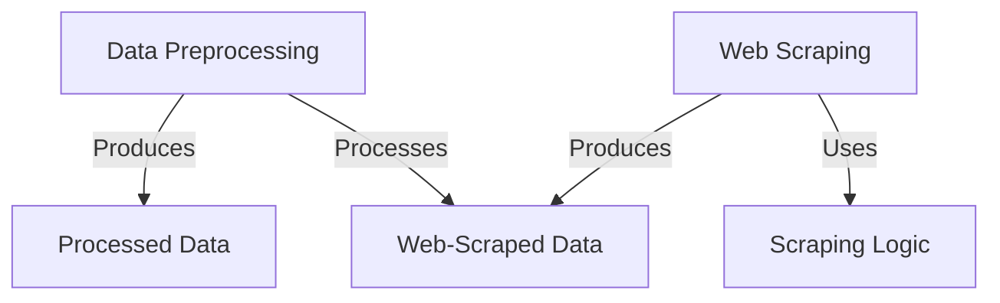

---

# Data Preprocessing & Web Scraping

This repository contains preprocessing scripts and web scraping code for two projects:

1. **Titanic Dataset**
2. **Web Scraping Datasets** (`PakWheels` and `ShopHive`)

---

## 📊 Titanic Dataset

The Titanic dataset contains information about passengers, including their demographics, ticket details, and survival status.
It is commonly used for classification tasks such as predicting survival based on features like age, gender, class, etc.

**🔗 Dataset Link:**
[https://www.kaggle.com/datasets/zainmahmod/pakistan-used-cars-2025](https://www.kaggle.com/datasets/zainmahmod/pakistan-used-cars-2025)

**📁 Folder:**
`/preprocessing` — contains a Jupyter notebook with all preprocessing steps including handling missing values, feature encoding, and scaling.

---

## 🕸️ Web Scraping

This section includes two folders for different web-scraped datasets:

### 🛻 PakWheels Used Cars Dataset

This dataset was created by scraping publicly available data from [PakWheels.com](https://www.pakwheels.com), covering used car listings across Pakistan.
It includes features such as title, mileage, model, engine capacity, price, transmission, and more.

**🔗 Dataset Link:**
👉 [View on Kaggle](https://www.kaggle.com/datasets/zainmahmod/pakistan-used-cars-2025)

**📁 Folder:**
`/WebScraping/PakWheels` — contains the Python code used to scrape PakWheels listings and export them to a CSV file.

---

### 🛒 ShopHive Dataset

Data was scraped from [ShopHive.com](https://www.shophive.com) to collect product listings for tech and consumer items.

**📁 Folder:**
`/WebScraping/ShopHive` — contains Python scripts and a JSON file with the scraped data.

---

# Tutorial: Data-Preprocessing-Web-Scraping

This project is about collecting and preparing data.
It includes **Web Scraping** tools to _automatically gather_ raw information from websites like car listings and product details.
It also provides **Data Preprocessing** steps to _clean and transform_ this raw data, making it ready for analysis or use in other applications.

## Visual Overview

## Chapters

1. [Web Scraping
   ](01_web_scraping_.md)
2. [Web-Scraped Data
   ](02_web_scraped_data_.md)
3. [Data Preprocessing
   ](03_data_preprocessing_.md)
4. [Processed Data
   ](04_processed_data_.md)
5. [Scraping Logic
   ](05_scraping_logic_.md)

---

---

## 🤝 Contributing

Pull requests are welcome. For major changes, please open an issue first to discuss what you would like to change.

---

## 📄 License

This project is licensed for educational and research use only.

---

